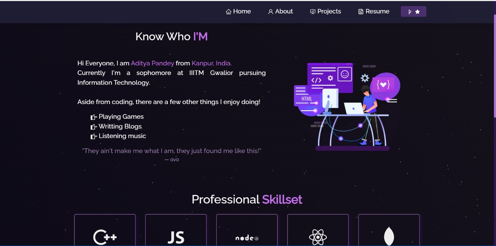

<h2 align="left">
  Portfolio Website 
  <a href="http://adicode.live/" target="_blank">adicode.live</a>
</h2>

  

 

## Built With

This is my portfolio website that has my projects,my toolstack,something about me and my resume.

It is built using these technologies.

- React.js
- Node.js
- Express.js

## Getting Started

Clone down this repository. You will need `node.js` and `git` installed globally on your machine.

## 🛠 Installation and Setup Instructions

1. Installation: `npm install`

2. In the project directory, you can run: `npm start`

Runs the app in the development mode.\
Open [http://localhost:3000](http://localhost:3000) to view it in the browser.
The page will reload if you make edits.
